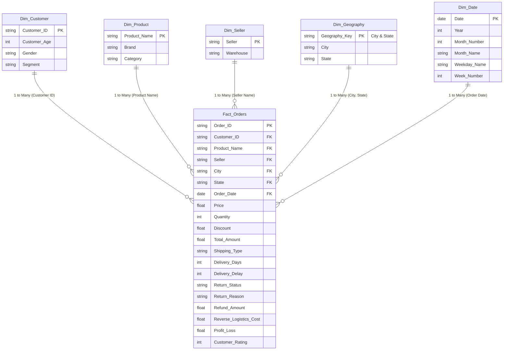

# Power BI Development Blueprint: E-Commerce Returns Dashboard

This blueprint provides the technical specifications, data modeling schema, DAX measures, and visual design layouts required to construct the interactive **E-Commerce Return and Refund Dashboard** in Power BI using `cleaned_data.csv`.

---

## 1. Data Model Architecture (Star Schema)

For optimal query performance in Power BI, load the cleaned dataset and split it into a **Star Schema** utilizing the Power Query Editor.



### Table Details & Transformations:
1. **Fact_Orders**: Map fields from `cleaned_data.csv`.
2. **Dim_Customer**: Deduplicate `cleaned_data.csv` on `Customer ID` and keep `Customer ID`, `Customer Age`, `Gender`, and `Segment`.
3. **Dim_Product**: Deduplicate on `Product Name` and keep `Product Name`, `Brand`, and `Category`.
4. **Dim_Seller**: Deduplicate on `Seller` and keep `Seller` and `Warehouse`.
5. **Dim_Date**: Generate using standard DAX Calendar function:
   ```dax
   Dim_Date = 
   ADDCOLUMNS(
       CALENDAR(MIN(Fact_Orders[Order Date]), MAX(Fact_Orders[Order Date])),
       "Year", YEAR([Date]),
       "Month Number", MONTH([Date]),
       "Month Name", FORMAT([Date], "MMMM"),
       "Weekday Name", FORMAT([Date], "dddd"),
       "Month Year", FORMAT([Date], "YYYY-MM"),
       "Month Year Sort", YEAR([Date]) * 100 + MONTH([Date])
   )
   ```
   *Note: Set the sort column of `Month Name` to `Month Number` and `Month Year` to `Month Year Sort` to preserve chronological ordering.*

---

## 2. DAX Calculations (Key Performance Indicators)

Create a dedicated measure table called `_Measures` and define the following metrics:

### Total Orders & Returns
```dax
Total Orders = COUNT(Fact_Orders[Order ID])
```
```dax
Returned Orders = CALCULATE([Total Orders], Fact_Orders[Return Status] = "Returned")
```
```dax
Return Rate = DIVIDE([Returned Orders], [Total Orders], 0)
```

### Financial Calculations
```dax
Gross Revenue = SUM(Fact_Orders[Total Amount])
```
```dax
Refunded Amount = SUM(Fact_Orders[Refund Amount])
```
```dax
Net Revenue = [Gross Revenue] - [Refunded Amount]
```
```dax
Reverse Logistics Cost = SUM(Fact_Orders[Reverse Logistics Cost])
```
```dax
Net Profit Loss = SUM(Fact_Orders[Profit_Loss])
```

### Averages
```dax
Average Delivery Days = AVERAGE(Fact_Orders[Delivery Days])
```
```dax
Average Customer Rating = AVERAGE(Fact_Orders[Customer Rating])
```
```dax
Average Order Value (AOV) = DIVIDE([Gross Revenue], [Total Orders], 0)
```
```dax
Average Refund per Return = DIVIDE([Refunded Amount], [Returned Orders], 0)
```

---

## 3. Dashboard Layout & Visualizations

We recommend a **3-Page Report Design** utilizing a professional dark blue / slate theme (e.g., primary colors `#1E3A8A` and secondary slate colors `#64748B`).

### Page 1: Executive Returns Summary
Designed for C-suite reviews to show macro return trends and financial impacts.

* **Top Card Row (KPIs)**:
  * Card 1: `Total Orders` (Sub-label: `Average Order Value`)
  * Card 2: `Return Rate` (Format as percentage with Red/Green conditional formatting: Green < 15%, Red > 25%)
  * Card 3: `Gross Revenue` (Sub-label: `Net Revenue`)
  * Card 4: `Refunded Amount` (Sub-label: `% Refunded`)
  * Card 5: `Net Profit Loss` (Sub-label: `Reverse Logistics Costs`)
* **Monthly Return Timeline (Line & Stacked Column Chart)**:
  * *X-Axis*: `Dim_Date[Month Year]`
  * *Columns Y-Axis*: `[Returned Orders]`
  * *Line Y-Axis*: `[Return Rate]`
* **Returns by Category (Clustered Bar Chart)**:
  * *Y-Axis*: `Dim_Product[Category]`
  * *X-Axis*: `[Return Rate]` (Sort descending)
  * *Data Labels*: On (Format as `0.0%`)
* **Return Reasons (Donut Chart)**:
  * *Legend*: `Fact_Orders[Return Reason]`
  * *Values*: `[Returned Orders]`

### Page 2: Operational & Seller Performance
Designed for supply chain and procurement teams to identify delivery and vendor pain points.

* **Delivery Delay Impact (Clustered Column Chart)**:
  * *X-Axis*: Create a calculated column `Is Delayed` = `IF(Fact_Orders[Delivery Delay] > 0, "Delayed", "On-Time")`
  * *Y-Axis*: `[Return Rate]`
* **Return Rate by Shipping Mode (Clustered Column Chart)**:
  * *X-Axis*: `Fact_Orders[Shipping Type]`
  * *Y-Axis*: `[Return Rate]`
* **Seller Refund Performance (Matrix / Table)**:
  * *Rows*: `Fact_Orders[Seller]`
  * *Values*: `[Gross Revenue]`, `[Refunded Amount]`, `Refund Percentage` (calculated as `[Refunded Amount] / [Gross Revenue]` formatted as `%`)
  * *Conditional Formatting*: Apply data bars or a background color scale to the `Refund Percentage` column to highlight underperforming sellers (like Seller E).
* **Warehouse Dispatch Return Volumes (TreeMap)**:
  * *Group*: `Fact_Orders[Warehouse]`
  * *Values*: `[Returned Orders]`

### Page 3: Customer Cohorts & Bracketing Analysis
Designed for operations and policy managers to evaluate bracketing behavior.

* **Bracketing KPIs**:
  * Create a column in Power Query to tag bracketing orders: Group by `Customer ID`, `Order Date`, and `Product Name` and flag any records where counts > 1 and at least one row has `Return Status` = "Returned".
  * Card 1: `Total Bracketing Orders`
  * Card 2: `Bracketing Loss ($)`
* **Bracketing Returns by Category (Bar Chart)**:
  * *Y-Axis*: `Dim_Product[Category]`
  * *X-Axis*: `[Total Bracketing Orders]`
* **Return Rate by Age Group (Clustered Column Chart)**:
  * *X-Axis*: Create a calculated column:
    ```dax
    Age Group = 
    SWITCH(
        TRUE(),
        Dim_Customer[Customer Age] <= 25, "18-25",
        Dim_Customer[Customer Age] <= 35, "26-35",
        Dim_Customer[Customer Age] <= 45, "36-45",
        Dim_Customer[Customer Age] <= 55, "46-55",
        "56+"
    )
    ```
  * *Y-Axis*: `[Return Rate]`
* **Chronic Returners (Table Visual)**:
  * *Rows*: `Customer ID`, `Lifetime Orders`, `Returned Orders`, `Return Rate`
  * *Filter*: Filter visual where `Lifetime Orders` >= 3 and `Return Rate` > 0.50.

---

## 4. Filters & Slicer Interaction Guidelines

For maximum interactivity, implement a **Sync Slicer Pane** accessible across all three report pages:

1. **Calendar Year** (`Dim_Date[Year]`) - Single Select dropdown.
2. **Product Category** (`Dim_Product[Category]`) - Multi-select list.
3. **State** (`Fact_Orders[State]`) - Searchable dropdown.
4. **Seller Name** (`Fact_Orders[Seller]`) - Dropdown list.
5. **Shipping Mode** (`Fact_Orders[Shipping Type]`) - Horizontal slider / buttons.
